```mermaid
flowchart TD
    classDef mat    fill:#f3e8ff,stroke:#7c3aed,color:#1a1a2e
    classDef ip     fill:#dbeafe,stroke:#1d4ed8,color:#1a1a2e
    classDef design fill:#dcfce7,stroke:#15803d,color:#1a1a2e
    classDef foundry fill:#fef3c7,stroke:#b45309,color:#1a1a2e
    classDef idm    fill:#ffedd5,stroke:#c2410c,color:#1a1a2e
    classDef osat   fill:#e0f2fe,stroke:#0369a1,color:#1a1a2e
    classDef test   fill:#f0fdf4,stroke:#166534,color:#1a1a2e

    %% ══════════════════════════════════════
    %% 上游：原材料 ／ 基板
    %% ══════════════════════════════════════
    subgraph UP["🪨 上游原材料與基板"]
        direction LR
        GW["環球晶圓 GlobalWafers\n8吋 ／ 12吋 矽晶圓"]
        UNI["欣興電子 Unimicron\nABF 高階 IC 載板"]
        KIN["景碩科技 Kinsus\nBT ／ ABF 載板"]
        NPCB["南亞電路板 Nan Ya PCB\nBT 基板"]
    end

    %% ══════════════════════════════════════
    %% EDA ／ 矽智財 IP
    %% ══════════════════════════════════════
    subgraph IP["💡 EDA 工具 ／ 矽智財 IP"]
        direction LR
        EMEM["力旺電子 eMemory\nNVM Embedded IP\n（OTP / MTP / Flash）"]
        AND["晶心科技 Andes Technology\nRISC-V 處理器 IP\n（AndesCore 系列）"]
        GUC["創意電子 Global Unichip\nASIC 設計服務\n（台積電設計聯盟夥伴）"]
    end

    %% ══════════════════════════════════════
    %% IC 設計 Fabless
    %% ══════════════════════════════════════
    subgraph FL["🖥 IC 設計（Fabless）"]
        direction LR
        MTK["聯發科技 MediaTek\nAP · 5G · WiFi 7 · IoT\n全球前二大 IC 設計"]
        NVT["聯詠科技 Novatek\n顯示驅動 IC · TCON\n全球前二大 Display Driver"]
        RTK["瑞昱半導體 Realtek\n以太網路 · 音效 · 儲存控制"]
        PHI["群聯電子 Phison\nSSD ／ eMMC ／ UFS 控制器\n全球 NAND 控制器龍頭"]
        SMI["慧榮科技 Silicon Motion\nNAND Flash 控制器\nEnterprise SSD"]
        PAR["譜瑞科技 Parade Technologies\nDP ／ HDMI ／ eDP 介面 IC"]
        HIM["奇景光電 Himax Technologies\n顯示驅動 IC · WiseEye AI"]
        ASM["祥碩科技 ASMedia\nUSB 4 · PCIe 5 · Thunderbolt"]
        RCH["立錡科技 Richtek\nPMIC · Buck ／ LDO\n（聯發科子公司）"]
        HOL["盛群半導體 Holtek\n8位元 ／ 32位元 MCU\n觸控 IC"]
    end

    %% ══════════════════════════════════════
    %% 晶圓代工 Foundry
    %% ══════════════════════════════════════
    subgraph FD["🏭 晶圓代工（Pure-Play Foundry）"]
        direction LR
        TSMC["台積電 TSMC\n2nm ～ 0.35μm 全製程\n先進封裝 CoWoS ／ InFO ／ SoIC\n全球晶圓代工市占 60%+"]
        UMC["聯華電子 UMC\n22nm ～ 0.5μm\n特殊製程：BCD · RFSOI · eFlash"]
        VIS["世界先進 VIS\n8吋 0.35 ～ 0.11μm\nPMIC · 顯示驅動 · MCU"]
        PSMC["力積電 PSMC\n12吋 ／ 8吋\nDRAM · Logic · CIS"]
        WIN["穩懋半導體 Win Semiconductors\nGaAs · GaN 化合物半導體\n手機 PA ／ RF 前端模組"]
    end

    %% ══════════════════════════════════════
    %% 整合元件製造商 IDM
    %% ══════════════════════════════════════
    subgraph IDM["⚙️ 整合元件製造商（IDM）"]
        direction LR
        WB["華邦電子 Winbond\nNOR Flash · pSRAM · DRAM\n自有 12吋廠（中科）"]
        NAN["南亞科技 Nanya Technology\nDDR4 ／ DDR5 DRAM\n自有 12吋廠（台茂）"]
        MX["旺宏電子 Macronix\nNOR Flash · Mask ROM\n自有 8吋廠（新竹）"]
    end

    %% ══════════════════════════════════════
    %% 封裝 OSAT
    %% ══════════════════════════════════════
    subgraph OSAT["📦 封裝（Assembly ／ OSAT）"]
        direction LR
        ASE["日月光投控 ASE Group\n含矽品精密 SPIL\n先進封裝 SiP · Flip-Chip · Fan-Out\n全球最大 OSAT"]
        PTI["力成科技 Powertech Technology\n記憶體 DRAM ／ Flash 封裝\nHBM 高頻寬記憶體封裝"]
        CMOS["南茂科技 ChipMOS Technologies\n顯示驅動 IC ／ 記憶體封裝\nCOF · BUMP · Gold Wire"]
        GRK["菱生精密 Greatek Electronics\nQFP · BGA · DIP · SOP 傳統封裝"]
    end

    %% ══════════════════════════════════════
    %% 測試 Testing
    %% ══════════════════════════════════════
    subgraph TEST["🔍 晶圓探針 ／ 成品測試（Test）"]
        direction LR
        KYEC["京元電子 King Yuan KYEC\n晶圓探針測試 · 成品終測\n邏輯 ／ 記憶體 ／ RF ／ SSD"]
        ARD["探微科技 Ardentec\n邏輯 IC · 類比 IC · SoC 終測"]
        ASETEST["日月光 ／ 矽品\n封測一條龍（Turnkey）\n附屬測試服務"]
        PTEST["力成 ／ 南茂\n封裝附屬測試"]
    end

    %% ══════════════════════════════════════
    %% 供應鏈連結 Supply Chain Links
    %% ══════════════════════════════════════

    %% 原材料 → 晶圓代工 ／ IDM
    GW   -->|矽晶圓供應| TSMC
    GW   -->|矽晶圓供應| UMC
    GW   -->|矽晶圓供應| VIS
    GW   -->|矽晶圓供應| PSMC
    GW   -->|矽晶圓供應| WB
    GW   -->|矽晶圓供應| NAN
    GW   -->|矽晶圓供應| MX

    %% 基板 → 封裝廠
    UNI  -->|ABF 高階載板| ASE
    KIN  -->|BT 載板| ASE
    KIN  -->|BT 載板| PTI
    NPCB -->|BT 基板| CMOS
    NPCB -->|BT 基板| GRK

    %% IP ／ EDA → 設計
    EMEM -->|NVM IP 授權| MTK
    EMEM -->|NVM IP 授權| NVT
    EMEM -->|NVM IP 授權| HOL
    AND  -->|RISC-V IP 授權| MTK
    AND  -->|RISC-V IP 授權| RTK
    AND  -->|RISC-V IP 授權| HOL
    GUC  -->|ASIC 設計服務| MTK
    GUC  -->|ASIC 設計服務| TSMC

    %% IC 設計 → 晶圓代工（主要委外關係）
    MTK  -->|委外流片| TSMC
    NVT  -->|委外流片| TSMC
    NVT  -->|委外流片| UMC
    RTK  -->|委外流片| TSMC
    PHI  -->|委外流片| TSMC
    SMI  -->|委外流片| TSMC
    PAR  -->|委外流片| UMC
    HIM  -->|委外流片| TSMC
    HIM  -->|委外流片| UMC
    ASM  -->|委外流片| TSMC
    RCH  -->|委外流片| VIS
    HOL  -->|委外流片| VIS
    HOL  -->|委外流片| PSMC

    %% 晶圓代工 → 封裝（裸晶 ／ KGD 供應）
    TSMC -->|裸晶 ／ KGD| ASE
    TSMC -->|裸晶 ／ KGD| PTI
    TSMC -->|裸晶 ／ KGD| CMOS
    UMC  -->|裸晶 ／ KGD| ASE
    UMC  -->|裸晶 ／ KGD| CMOS
    VIS  -->|裸晶| ASE
    VIS  -->|裸晶| GRK
    PSMC -->|裸晶 DRAM| PTI
    WIN  -->|GaAs ／ GaN 裸晶| ASE

    %% IDM → 封裝（部分外包）
    WB   -->|記憶體裸晶| PTI
    WB   -->|記憶體裸晶| CMOS
    NAN  -->|DRAM 裸晶| PTI
    MX   -->|Flash 裸晶| CMOS
    MX   -->|Flash 裸晶| GRK

    %% 封裝 → 測試
    ASE  -->|整合封測| ASETEST
    PTI  -->|封裝附屬測試| PTEST
    CMOS -->|封裝附屬測試| PTEST
    ASE  -->|委外終測| KYEC
    GRK  -->|委外終測| KYEC
    PTI  -->|委外終測| KYEC
    CMOS -->|委外終測| ARD

    %% 套用顏色
    class GW,UNI,KIN,NPCB mat
    class EMEM,AND,GUC ip
    class MTK,NVT,RTK,PHI,SMI,PAR,HIM,ASM,RCH,HOL design
    class TSMC,UMC,VIS,PSMC,WIN foundry
    class WB,NAN,MX idm
    class ASE,PTI,CMOS,GRK osat
    class KYEC,ARD,ASETEST,PTEST test
```

# 台灣半導體供應鏈關係網路
# Taiwan Semiconductor Supply Chain Network

> 涵蓋矽智財 IP → IC 設計 → 晶圓代工 → 封裝 → 測試各環節的主要台灣廠商及供應關係。
> Covers key Taiwanese players and supply relationships across IP → Design → Foundry → Packaging → Testing.

---

---

## 各環節說明

### 🪨 上游原材料與基板

| 公司 | 產品 | 角色 |
|------|------|------|
| 環球晶圓 GlobalWafers | 8吋 ／ 12吋 矽晶圓 | 全球第三大矽晶圓廠，供應所有晶圓代工廠與 IDM |
| 欣興電子 Unimicron | ABF 高階 IC 載板 | 台灣最大 IC 載板廠，供 TSMC CoWoS、ASE 先進封裝 |
| 景碩科技 Kinsus | BT ／ ABF 載板 | 主供記憶體與 SSD 控制器封裝基板 |
| 南亞電路板 Nan Ya PCB | BT 基板 | 供傳統封裝用基板，隸屬台塑集團 |

---

### 💡 EDA 工具 ／ 矽智財 IP

| 公司 | 核心 IP ／ 服務 | 主要客戶 |
|------|--------------|---------|
| 力旺電子 eMemory | NVM Embedded IP（OTP / MTP / Flash IP） | 全球 300+ 授權客戶，台灣 IC 設計廠標配 |
| 晶心科技 Andes Technology | RISC-V 處理器 IP（AndesCore） | 聯發科、瑞昱、盛群等 |
| 創意電子 Global Unichip | ASIC 設計服務、IP 整合 | 台積電設計聯盟一級夥伴，承接 hyperscaler 客製晶片 |

---

### 🖥 IC 設計（Fabless）

| 公司 | 主要產品 | 主要代工廠 |
|------|---------|----------|
| 聯發科技 MediaTek | AP（天璣系列）、5G 數據機、WiFi 7、IoT SoC | TSMC 4nm ／ 5nm ／ 7nm |
| 聯詠科技 Novatek | 顯示驅動 IC（DDIC）、TCON、ISP | TSMC、UMC |
| 瑞昱半導體 Realtek | 2.5G ／ 5G 以太網路、音效、PCIe 儲存控制器 | TSMC |
| 群聯電子 Phison | SSD ／ eMMC ／ UFS NAND 控制器 | TSMC |
| 慧榮科技 Silicon Motion | NAND Flash 控制器、Enterprise SSD 主控 | TSMC |
| 譜瑞科技 Parade | DisplayPort ／ HDMI ／ eDP 介面 IC | UMC |
| 奇景光電 Himax | LCOS 顯示驅動 IC、WiseEye AI 感測 SoC | TSMC、UMC |
| 祥碩科技 ASMedia | USB 4、PCIe 5.0、Thunderbolt 控制器 | TSMC |
| 立錡科技 Richtek | PMIC 電源管理（聯發科子公司） | 世界先進 VIS |
| 盛群半導體 Holtek | 8 ／ 32 位元 MCU、觸控 IC | 世界先進 VIS、力積電 |

---

### 🏭 晶圓代工（Pure-Play Foundry）

| 公司 | 製程節點 | 特色 |
|------|---------|------|
| 台積電 TSMC | 2nm ～ 0.35μm | 全球技術領先；CoWoS ／ InFO ／ SoIC 先進封裝自建能力 |
| 聯華電子 UMC | 22nm ～ 0.5μm | 特殊製程強項：BCD、RFSOI、eFlash、高壓製程 |
| 世界先進 VIS | 0.35 ～ 0.11μm（8吋） | PMIC、顯示驅動 IC、電源元件成熟製程 |
| 力積電 PSMC | 12吋 ／ 8吋 | DRAM、Logic、CMOS Image Sensor |
| 穩懋半導體 Win Semi | GaAs HBT ／ GaN HEMT | 手機 PA ／ RF 前端模組，化合物半導體龍頭 |

---

### ⚙️ 整合元件製造商（IDM）

| 公司 | 主要產品 | 自有晶圓廠 |
|------|---------|----------|
| 華邦電子 Winbond | NOR Flash、pSRAM、低功耗 DRAM | 台中科學園區 12吋廠 |
| 南亞科技 Nanya Technology | DDR4 ／ DDR5 DRAM | 台茂 12吋廠（台塑集團旗下） |
| 旺宏電子 Macronix | NOR Flash、Mask ROM | 新竹 8吋廠 |

---

### 📦 封裝（Assembly ／ OSAT）

| 公司 | 封裝技術 | 特色 |
|------|---------|------|
| 日月光投控 ASE Group（含矽品精密 SPIL） | SiP、Flip-Chip、Fan-Out、Wire Bond、先進封裝 | 全球最大 OSAT；VIPack 先進封裝平台 |
| 力成科技 Powertech Technology | Wire Bond、Flip-Chip、HBM 堆疊封裝 | 記憶體封裝領導者，HBM 供應鏈關鍵 |
| 南茂科技 ChipMOS Technologies | COF（Chip-on-Film）、BUMP、Wire Bond | 顯示驅動 IC 封裝全球前段班 |
| 菱生精密 Greatek Electronics | QFP、BGA、DIP、SOP 傳統封裝 | 消費性電子傳統封裝廠 |

---

### 🔍 晶圓探針 ／ 成品測試（Testing）

| 公司 | 測試類型 | 特色 |
|------|---------|------|
| 京元電子 KYEC | 晶圓探針測試（CP）、成品終測（FT） | 邏輯、記憶體、RF、SSD 控制器全涵蓋 |
| 探微科技 Ardentec | 邏輯 IC、類比 IC、SoC 終測 | 聯發科旗下廠商 |
| 日月光 ／ 矽品（封測一條龍） | CP + FT 整合 Turnkey 服務 | OSAT 附屬測試，垂直整合 |
| 力成 ／ 南茂（附屬測試） | 記憶體封裝後測試 | DRAM ／ Flash 封裝附屬測試 |

---

## 關鍵供應鏈結構觀察

1. **台積電的核心樞紐地位**：幾乎所有台灣 Fabless IC 設計公司最終都委由台積電製造，台積電同時往下延伸自建先進封裝（CoWoS、InFO），形成「設計→代工→封裝」垂直整合趨勢。

2. **IDM 的雙軌模式**：華邦、南亞科技、旺宏自有晶圓廠，但封裝仍大量外包給 OSAT 廠，尤其力成（記憶體封裝）與南茂（Flash 封裝）。

3. **日月光的垂直整合**：日月光投控透過收購矽品精密，形成全球最大封測集團，並提供完整 Turnkey（委外製造後段一條龍）服務。

4. **記憶體供應鏈集中**：DRAM（南亞科技）→ 力成科技封裝 → 京元電子測試，形成台灣本土記憶體封測鏈；HBM 高頻寬記憶體則由力成主導封裝。

5. **化合物半導體獨立鏈**：穩懋半導體（GaAs ／ GaN）→ 日月光封裝，供應手機 RF 前端模組，與矽基主流製程平行存在。

6. **IP 層的槓桿效應**：力旺電子（NVM IP）授權遍及台灣 300+ 客戶，晶心科技（RISC-V IP）嵌入聯發科、瑞昱、盛群等主力 SoC，台灣本土 IP 生態系成熟。

---

*最後更新：2026-05-07*
